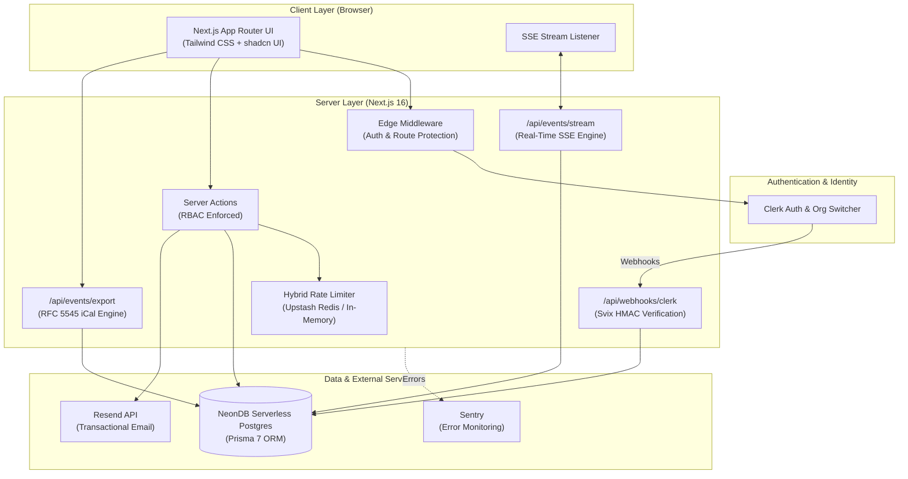

# EventSync — Multi-Tenant SaaS Platform

[](https://www.typescriptlang.org/)
[](https://nextjs.org/)
[](https://www.prisma.io/)
[](https://tailwindcss.com/)
[](https://vitest.dev/)

EventSync is a production-grade **Multi-Tenant Event Management SaaS** built with **Next.js 16 App Router**, **Clerk Authentication**, **NeonDB Serverless Postgres**, **Prisma ORM**, and **Tailwind CSS**.

It is designed as an architectural reference implementation demonstrating production SaaS patterns beyond simple CRUD operations: DB-backed multi-tenant RBAC, Svix HMAC webhook idempotency, hybrid serverless rate limiting, real-time Server-Sent Events (SSE), RFC 5545 iCalendar exports, and transactional email notifications.

---

## 🏛 System Architecture



---

## ✨ Features & Architecture Highlights

### 🔒 1. Multi-Tenant Role-Based Access Control (RBAC)
- **Database-Authoritative RBAC**: Membership roles (`ADMIN`, `MANAGER`, `MEMBER`) are stored directly in Postgres, avoiding lock-in to external auth provider metadata.
- **Tenant Isolation**: Every database query is strictly scoped by `organizationId`. Cross-tenant data leaks (IDOR) are prevented at the data access layer and verified via unit tests.
- **Role Enforcement**: Mutating Server Actions invoke `requireRole(["ADMIN", "MANAGER"])` before touching the database.

### ⚡ 2. Real-Time Server-Sent Events (SSE)
- **Persistent Live Stream**: `/api/events/stream` pushes live updates to active organization members when events are created or updated.
- **Non-Blocking Architecture**: Enables collaborative updates across browser sessions without page reloads.

### 📩 3. Transactional Email Notifications
- **Resend Integration**: Dispatches responsive HTML emails to organization members when a new event is scheduled.
- **Safe Fallback Protocol**: Gracefully handles missing API keys in development without throwing errors or blocking app execution.

### 📅 4. RFC 5545 iCalendar (.ics) Export
- **Universal Export**: Standard iCalendar endpoint (`/api/events/export`) allows exporting all organization events or single events directly to Google Calendar, Apple Calendar, or Outlook.
- **Zero External Dependencies**: Clean, native RFC 5545 text generator with line-folding and parameter escaping.

### 🎟️ 5. Event RSVP & Attendance Tracking
- **Interactive RSVPs**: Members can mark status as `Going`, `Maybe`, or `Not Going`.
- **Optimistic UI**: Instant client UI updates with rollback on failure.

### 📊 6. Analytics & Observability
- **Interactive Dashboard**: Recharts-powered data analytics displaying monthly trends, upcoming vs. past distribution, day-of-week breakdown, and top event creators.
- **Webhook Audit Logs**: Real-time webhook ingestion log UI (`/dashboard/admin/webhooks`) with status badges and error payloads.
- **Sentry Integration**: Captures client, server, and edge errors in production.

### 🛡️ 7. Webhook Security & Idempotency
- **Svix HMAC-SHA256**: Cryptographically verifies webhook payloads received from Clerk.
- **Replay Protection**: Rejects events with timestamp drift greater than 5 minutes.
- **Idempotency Guard**: Deduplicates incoming deliveries by logging `svixId` in `WebhookEvent` audit log.

---

## 🛠 Tech Stack

- **Framework**: Next.js 16 (App Router, Server Actions, React Compiler)
- **Language**: TypeScript 5
- **Authentication**: Clerk (`@clerk/nextjs`)
- **Database & ORM**: NeonDB (Serverless Postgres) + Prisma 7 ORM (`@prisma/adapter-pg`)
- **Styling**: Tailwind CSS v4, shadcn/ui (`@base-ui/react`), Lucide Icons, `next-themes`
- **Charts**: Recharts
- **Email**: Resend
- **Rate Limiting**: `@upstash/ratelimit` / `@upstash/redis` with in-memory fallback
- **Testing**: Vitest (`@vitest/coverage-v8`), Playwright E2E

---

## 🚀 Getting Started

### Prerequisites
- Node.js 18+ and `npm`
- A free [NeonDB](https://neon.tech) PostgreSQL database
- A free [Clerk](https://clerk.com) account

### Setup Instructions

1. **Clone the repository:**
   ```bash
   git clone https://github.com/your-username/EventSync.git
   cd EventSync
   ```

2. **Install dependencies:**
   ```bash
   npm install
   ```

3. **Configure Environment Variables:**
   Copy `.env.example` to `.env.local`:
   ```bash
   cp .env.example .env.local
   ```
   Fill in your credentials for Clerk and NeonDB in `.env.local`.

4. **Initialize Database Schema:**
   ```bash
   npm run db:push
   ```

5. **(Optional) Seed Demo Data:**
   ```bash
   npm run seed
   ```

6. **Start the Development Server:**
   ```bash
   npm run dev
   ```
   Open [http://localhost:3001](http://localhost:3001) in your browser.

---

## 🧪 Testing & Verification

Run unit & integration test suite:
```bash
npm test
```

Run TypeScript type check:
```bash
npm run typecheck
```

Run end-to-end Playwright tests:
```bash
npm run test:e2e
```

---

## 🔑 Environment Variables

| Variable | Description | Required |
|---|---|---|
| `NEXT_PUBLIC_CLERK_PUBLISHABLE_KEY` | Clerk Publishable Key | Yes |
| `CLERK_SECRET_KEY` | Clerk Secret Key | Yes |
| `CLERK_WEBHOOK_SECRET` | Clerk Webhook Signing Secret | Yes |
| `DATABASE_URL` | NeonDB Pooled Connection String | Yes |
| `DIRECT_URL` | NeonDB Direct Connection String | Yes |
| `NEXT_PUBLIC_APP_URL` | Application Root URL (e.g. `http://localhost:3001`) | Yes |
| `RESEND_API_KEY` | Resend API Key for Email Notifications | Optional |
| `SENTRY_DSN` | Sentry DSN for Error Tracking | Optional |

---

## 📄 License

MIT License. Free to use as a boilerplate for commercial or personal projects.
